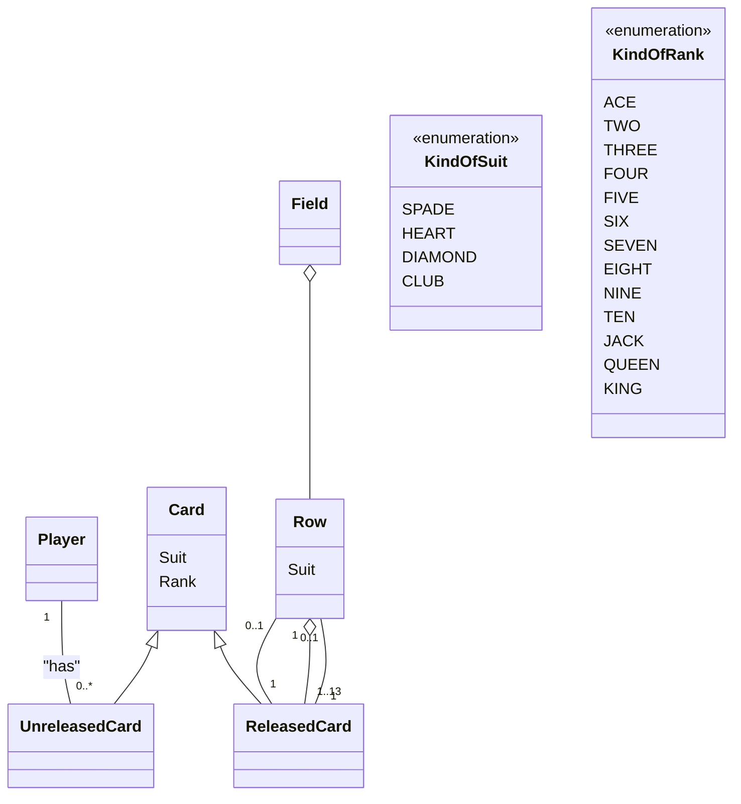

# Seven In Row 「七並べ」の実装

OOC 2024 のノベルティグッズとして提供されたクラス図を元に PHP で実装してみたものです

## Glossary 用語集

| 用語    | 用語(英名) | 説明                                                  |
|-------|--------|-----------------------------------------------------|
| スート   | Suit   | トランプカードのマークのことです。 スペード、ハート、ダイヤ、クラブの 4 種類が存在します。  |
| ランク   | Rank   | トランプカードの数字および AJQK のことです。 13 種類のランクがあります。        |
| 場     | Field  | プレイヤーが七並べのカードを出すところです。                              |
| 列     | Column | カードがスートごとに分類されるルールを適用するためのものです。                     |
| プレイヤー | Player | 七並べのゲームの参加者のことです。                                   |
| カード   | Card   | トランプのカードのことです。 スートごとに 13 枚のカードがあり、全部で 52 枚となります。 |

## クラス図

## Reference Link 参考リンク

* mermaid 記法のクラス図の書き方
    https://github.com/mermaidjs/mermaidjs.github.io/blob/master/classDiagram.md
